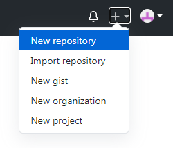
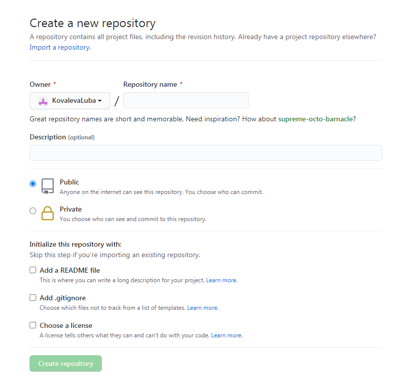

## Начало работы

Для начала работы с git нам понадобится редактор [VS Code](https://code.visualstudio.com/) (либо любой другой редактор) и аккаунт на [GitHub](https://github.com/).
___
Прежде всего необходимо указать имя и электронную почту для дальнейшей работы с git. Вводим:
```
git config --global user.name "name"

git config --global user.email "email@adress.com"
```
Затем создадим удаленный репозиторий на [GitHub](https://github.com/).

Для этого нажимаем на + в правом верхнем углу и выбираем __New repository__



Указываем имя нового репозитория, выбираем тип (публичный или приватный) и нажимаем  __Create repository__



[<](intro.md) | [К оглавлению](readme.md) | [>](local_repository.md)